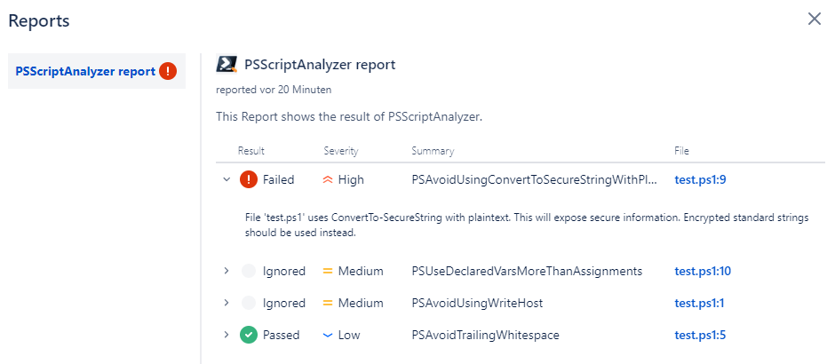

# BitBucket-Pipeline-PSScriptAnalyzer

## Table of Contents

- [Introduction](#introduction)
- [Installation](#installation)
- [Example Report](#example-report)

## Introduction

This is a pipeline for BitBucket that uses PSScriptAnalyzer to check PowerShell modules and scripts.
The results of the PSScriptAnalyzer are converted to BitBucket pipeline Report.

Additional information about PSScriptAnalyzer can be found [here](https://github.com/PowerShell/PSScriptAnalyzer/)

## Installation

To use the PSScriptAnalyzer pipeline in BitBucket you just need to copy the `bitbucket-pipelines.yml` to your BitBucket repository.

## Example Report

